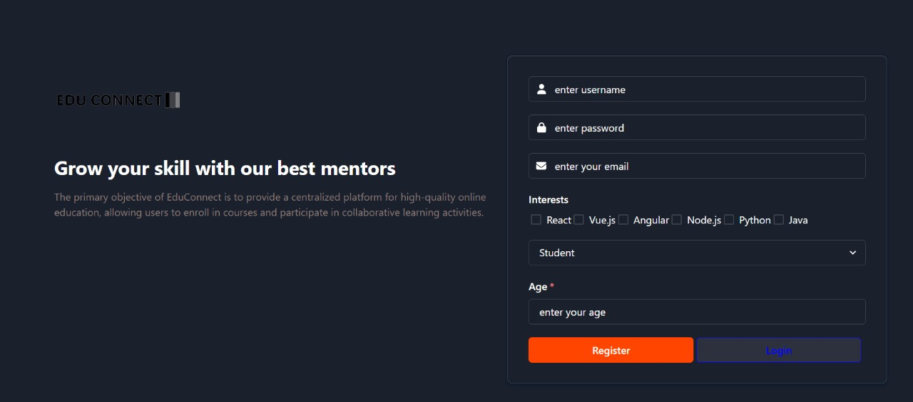
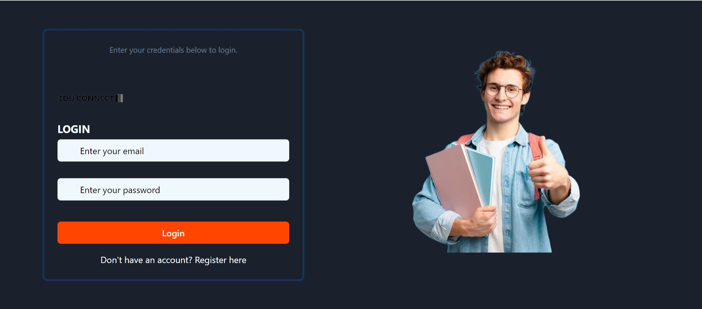
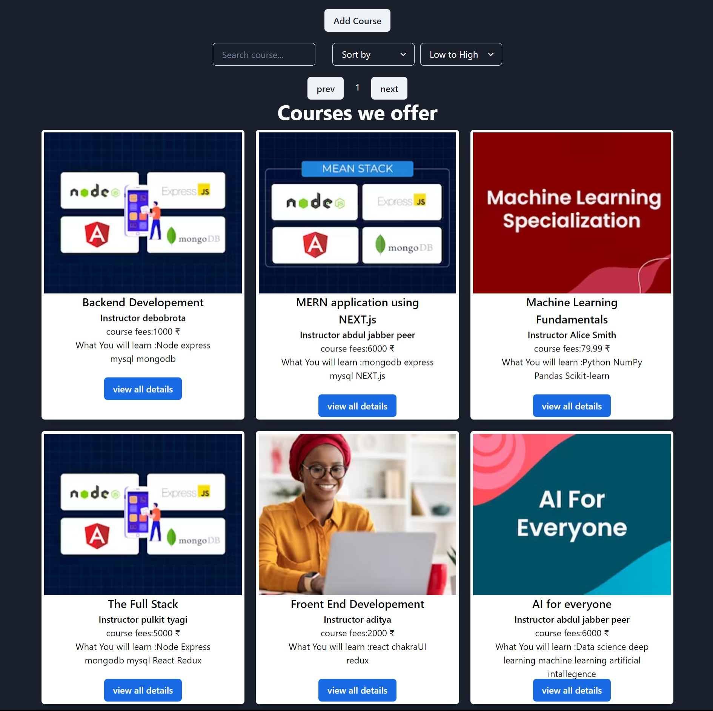
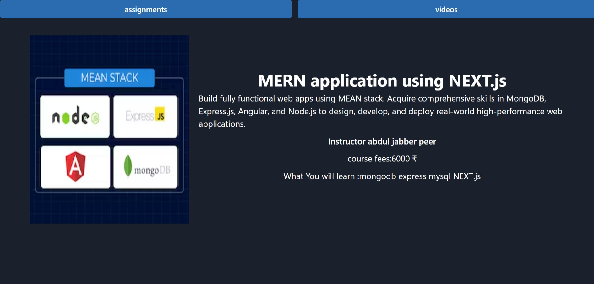
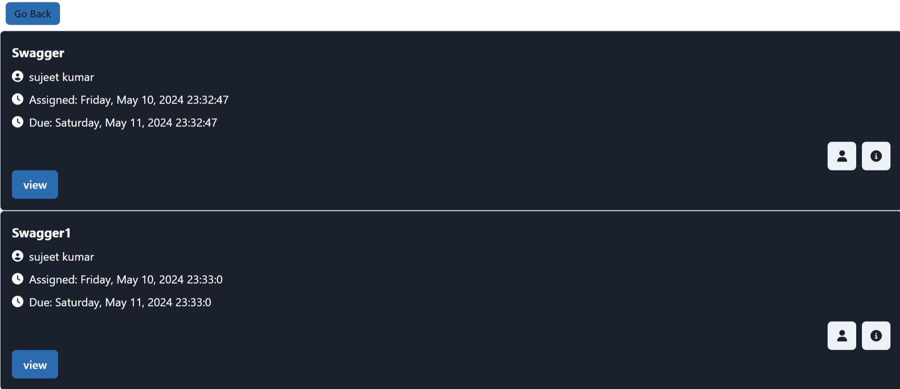
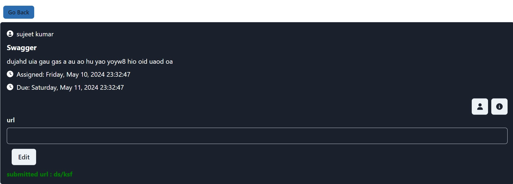
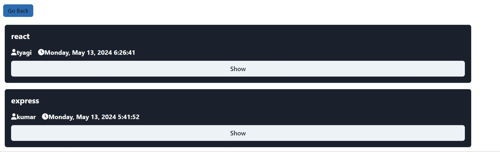

# EduConnect-


## Introduction
EduConnect is an innovative education platform designed to facilitate interactive learning experiences, connecting students, educators, and educational content creators. Inspired by platforms like Coursera and Udemy, EduConnect aims to offer a wide range of courses, personalized learning paths to enhance the learning journey. EduConnect is to provide a centralized platform for high-quality online education, allowing users to enroll in courses, track their progress, and participate in collaborative learning activities.

## Team Members

    - Team Lead: [Supriya Hatele] 
    - Team Members: 
        [Supriya Hatele] 
        [Pavan Kumar] 
        [Sujeet Kumar]
       

## Project Type
Frontend | Backend | Fullstack

## Deplolyed App
    Frontend: https://edu-connect-kappa.vercel.app/
    Backend:https://educonnect-backend-5h8y.onrender.com/


## Technologies Used
- **Backend**:
  - Node.js
  - Express.js
  - MongoDB
  - JSON Web Tokens (JWT) for authentication
- **Frontend**:
  - HTML
  - CSS
  - JavaScript
  - React.js
- **Other Tools**:
  - bcrypt.js for password hashing
  - Redux for state management
  - Axios for HTTP requests

## Directory Structure
      Educoonect/
      ├─.
      ├── server
      │   ├── config
      │   ├── controllers
      │   ├── middlewares
      |   ├── models
      |   ├── routes
      |   ├── uploads
      |   ├──.gitignore
      │   ├── index.js
      │   ├── package-lock.json
      │   └── package.json
      └── frontend
            ├── public
            │   └── ...
            │
            └── src
                │
                ├── assets
                │   └── ...
                │
                ├── components
                │   ├── Assignmnets
                │   ├── Videos
                ├── contexts
                │   └── AuthContextProvider.jsx
                │── navbar
                     ├── navbar.jsx
                ├── pages
                   ├── About.jsx
                   ├── Assignmnet.jsx
                   ├── Courses.jsx
                   ├── Footer.jsx
                   ├── Home.jsx
                   ├── Profile.jsx
                   ├── QuizData.jsx
                   ├──  Signup.jsx
                   ├── SingleCourse.jsx
                   ├── Videos.jsx
                ├── redux
                │   ├── actionTypes
                │   ├── actions
                │   ├── reducers
                │   └── utils
                │── routes
                     ├── AllRoutes
                     ├── PrivateRoute.jsx
                ├── App.css
                ├── App.jsx
                ├── index.css
                ├── main.tsx
                ├── vite-env.d.ts
                ├── index.html


## Features

### Authentication
- Users must log in to access courses.
- Passwords are securely hashed.
- Token-based authentication for secure access.
- Role-based access control:
  - **Student**: Enroll in courses, submit assignments.
  - **Educator**: Create courses, assignments, and videos.

### Course Management
- **Student Dashboard**:
  - View enrolled courses.
  - Submit assignments.
- **Educator Dashboard**:
  - Create courses.
  - Add assignments and videos to courses.

### Course Content
- **Assignments**:
  - Students can submit assignments.
  - Educators can create and assess assignments.
- **Videos**:
  - Educators can upload videos for course content.

### Course Navigation
- **Pagination**:
  - Navigate through multiple pages of course listings.
- **Filters**:
  - Filter courses by price.
- **Search Functionality**:
  - Search for courses based on keywords.


## Installation Usage:
1. Clone the repository:

git clone 

2. Navigate to the project directory:

### Frontend:
```bash
cd EduConnect/client
npm install i
npm run dev
```

### Backend:
```bash
cd EduConnect/server
npm run server

```

3. Access the Application: "Once both the backend and frontend servers are running, you can access the application by opening your web browser and navigating to http://localhost:3000 (assuming the frontend server is running on port 3000). You should see the shop-cart clone interface where you can explore Products from various categories."

## Screenshots:

### SignupPage/RegisterPage



### LoginPage



### HomePage


### Courses Page



### Single Course Page



### Assignment page



### SigleAssignment Page



### videos page



## Credentials:

To access authenticated pages, you can use the following credentials:

{
  "email": "user@gmail.com",
  "password": "1234"
},


## Contributing:
Contributions are welcome! If you would like to contribute to this project, please follow these steps:
1. Fork the repository.
2. Create a new branch (`git checkout -b feature/improvement`).
3. Make your changes.
4. Commit your changes (`git commit -am 'Add new feature'`).
5. Push to the branch (`git push origin feature/improvement`).
6. Create a new Pull Request.

